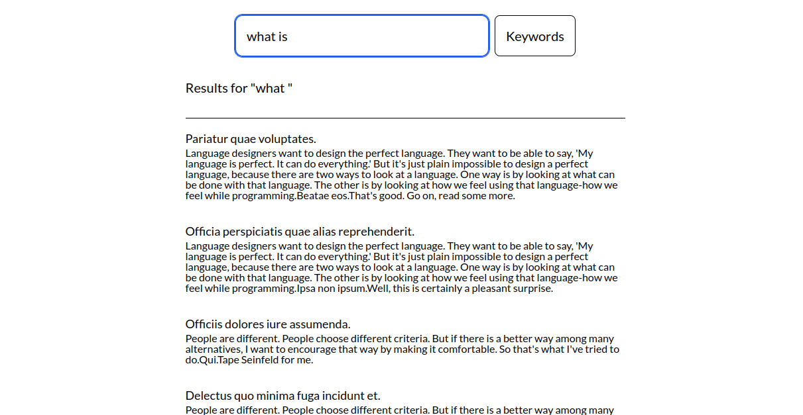

# Helpjuice Assessment 

> This is an assignment given by Helpjuice

## Description

The purpose of this project is to store complete searches correctly.

## Features

- Articles can be searched.
- All searches can be checked.

## Built with

- Ruby v3.1.2
- Ruby on Rails v7.0.4
- TailwinCSS
- Sidekiq

## Live demo

Please [check](https://helpjuice-assignment.fly.dev/).

## Setup locally

- Clone this repository
- Open a terminal window
- Change directory by using `cd helpjuice-assignment/`
- Run `bin/setup`
- Run `bin/rails db:migrate`
- Run `bin/rails db:seed`
- Run your `redis-server` because Sidekiq is used to handle background jobs and it connects to Redis
- Open rails server by using `bin/dev`
- Open browser and go to http://localhost:3000

## Test app

- Follow steps given in Setup part
- Install Chrome from [main page of Chrome](https://www.google.com/chrome/) or [terminal](https://linuxize.com/post/how-to-install-google-chrome-web-browser-on-ubuntu-18-04/)
- Run `rails db:test:prepare` on your terminal
- Run `rspec`

## Deploy to Fly.io

- Open a terminal window
- Run `fly launch` by overriding files. Copy only the name of the created app on `fly.toml`, and paste to the old files. Please don't change anything except the name of the app.
- Run `fly redis create`, and copy the path starting with `redis://default::`
- Run `fly secrets set REDIS_URL=copied_path`
- Run `fly deploy`
- Open your browser and go to the link given Fly.io for this project

## Authors

Reach out to us at one of the following places!

👤 **Hasan Özovalı**

- LinkedIn: [Hasan Ozovali](https://www.linkedin.com/in/hasan-ozovali/)
- Github: [@ozovalihasan](https://github.com/ozovalihasan)
- Twitter: [@ozovalihasan](https://twitter.com/ozovalihasan)
- Mail: [ozovalihasan@gmail.com](ozovalihasan@gmail.com)
